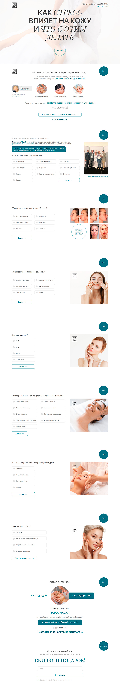

# TheSELF - Quiz

The task was to develop a page of user survey for the website of theSelf company according to the Figma design layout. The user answers the quiz questions, after which they are offered cosmetic services depending on their preferences at a discount. Data about the results and user contacts are stored in a MySQL database and sent to the client's mail.

